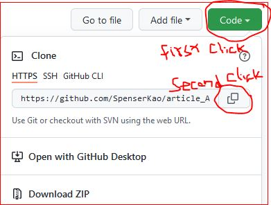

# Technical Test on Article API
## _Abstract_
For the technical test on an set of article API, this document outlines its requirements, and the design, development environment, test for its implementation. 
**Each original requirement is assigned a unique id starting with capital 'R'**, which helps requirements management, especially when no management system is in place that is critical for team-based software development.
Such unique requirement identification is also vital in designing test plan, particularly test case-to-requirement matrix. In addition, these requirement ids have been cited in codebase for pertinent implementation. 
Other than three endpoins specified in teh original requirements, I have further added one to list attributes of all articles.
## _Requirements_
### Endpoints
It's required to create a simple API with three endpoints.
- **_R1_: POST/articles** - Should hanlde the receipt of some article data in JSON format, and store within the service.
- **_R2_: GET/articles/{id}** - Should return the JSON representation of the article.
- **_R3_: GET/tags/{tagName}/{date}** - Should return the list of article(s) that have that tag name on the given date and some summary data about that tag for that day. 
- **_R4_: GET/articles/all** - Not part of requirements, but proposed to list all articles' attributes. 
### Content Structure of an Article
**_R5_**: An article has the following _attributes id_, _title_, _date_, _body_, and _list of tags_. for example:
```json
{
  "id": "1",
  "title": "latest science shows that potato chips are better for you than sugar",
  "date" : "2016-09-22",
  "body" : "some text, potentially containing simple markup about how potato chips are great",
  "tags" : ["health", "fitness", "science"]
}
```
### Content Structure of **GET/tags/{tagName}/{date}** result in JSON
**_R6_**: The GET /tags/{tagName}/{date} endpoint should produce the following JSON. Note that the actual url would look like _/tags/health/20160922_.
```json
{
  "tag" : "health",
  "count" : 17,
  "articles" :
      [
        "1",
        "7"
      ],
  "related_tags" :
      [
        "science",
        "fitness"
      ]
}
```
**_R7_**: The **_related_tags_** field contains a list of tags that **_are on the articles that the current tag is on for the same day_**. It should not contain duplicates.<br/>
**_R8_**: The **_count_** field **_shows the number of tags_** for the tag for that day.<br/>
**_R9_**: The **_articles_** field contains a list of ids for the **_last 10 articles entered for that day_**.

## Design
<br/>
**_Gin_** web framework is utilised to build the application.<br/>
**_Gin_** is a HTTP web framework written in Go (Golang). It features a Martini-like API with up to 40 times faster performance. 

### List of assumptions
1. For requirement #8 (R8), those counted tags are non-duplicate, including inquiring tag name.
1. The date of each article proposed in the original requirements is assumed to be publishing date, hence I have to add a date-related field also contain time, of the article's entry, in order to be sortable to include the last **_ten_** articles **_entered_** for the date. The added field shall contain UTC time and be named **_EntryTime_**.
### Source of articles data
For the sake of maintenance, the source of articles data shall be contained in a file named **_articles.json_**. For possible further population of the input data, just do it at the file without having to go to modify the **_Go_** code, followed by rebuilding of the code.

### Choice of languages and library
While **_Go_** language is mandatory, **_Gin_** web framework is chosen as backbone to implement the application.
| Language/Library | Version | Reference |
|---------------|---------|--------|
| Golang | go1.17.1 windows/amd64 | |
| github.com/gin-contrib/sse | v0.1.0 | go.mod & go.sum |
| github.com/gin-gonic/gin | v1.7.7 | go.mod & go.sum |

## Development Environment
### IDE (Integrated Development Environment)
To code, execute the application at the server side. Or even execute curl command to communicate with the application at server side from client side.
| Tool | Version | 
|---------------|---------|
| Visual Studio Code | v1.63.2 |
### Web Browser
To open URL to access the article API. Following three major brands of browser work as expected.
| Tool | Version | 
|---------------|---------|
| Firefox Developer Edition | v97.0b4 (64-bit) |
| Google Chrome | v97.0.4692.71 (Official Build) (64-bit) |
| Microsoft Edge | v97.0.1072.02 (Official Build) (64-bit) |

### Command line tool
To transfer data to and from a server that hosts the article API.
| Tool | Version | Remark |
|---------------|---------|-------|
| cURL | v7.65.3 (x86_64-w64-mingw32) | aka Client URL |

### GitBash
When not issued from VS Code, we need an shell emulation layer for executing cURL command, or issuing Git command.
| Tool | Version | Remark |
|---------------|---------|-------|
| GitBash | v2.23.0.windows.1 | aka Client URL |

## Setup/Installation
### Enter GitBash and Preparation
Open a GitBash and change into a working directory.<br/>
Execute following command: <br/>
<code>
git init  
</code>

### Cloning
Left-mouse click on green "Code"  button at middle right of the screen, then click on  button, as illustrated by the screenshot below. <br/>
<br/>
Then you will see the cloning process as shown below.
<br/>

## Configuration
Eventhough it's kind of low frequency of adjustment, I make following three constants configurable at the beginning of codebase **_main.go_**.
| Constant | Value (string) |
|---------------|---------|
| DevHostURL | localhost:8080
| ARTICLES_FILE | articles.json |
| MAX_ARTICLES_OF_TAGNAME_DATE_QUERY | 10 |

## Execution

## Test Plan

## Wish list
- Move articles data from file to MongoDB
- Integrate Selenium + Ginkgo + Gomock for automated web application test
